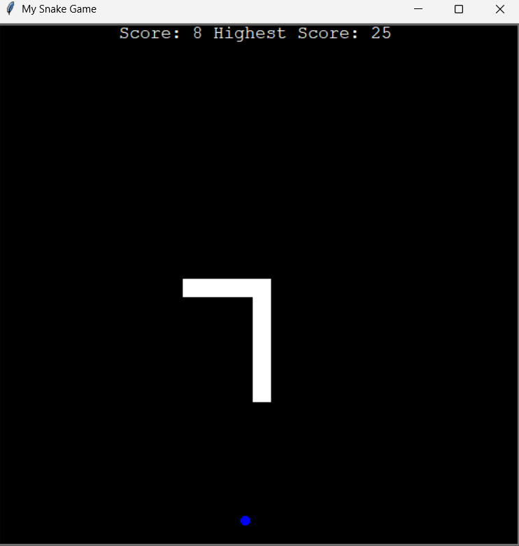

# Snake Game 🐍

A classic Snake Game implemented in Python using Pygame.  
This version features smooth controls, real-time scoring, and a persistent **High Score** system that saves your best performance across sessions.

## 🎮 Features
- Smooth snake movement and collision detection
- Real-time score display
- **Persistent High Score** saved locally
- Simple and intuitive controls

## 🛠 Tech Stack
- **Python 3**
- **turtle** library

## 📂 Project Structure
Snake-Game/
│── main.py # Main game logic
│── snake.py # Handles snake movement, growth
│── food.py # Handles food generation and placement
│── scoreboard.py # Manages current score and high score saving
│── data.txt # Stores the highest score
│── README.md # Project documentation
│── assets # Project Screenshot

## 🛠 Requirements
- Python 3.x  
- No external libraries required (uses built-in modules: `turtle`, `time`, `random`)

## 🚀 How to Run
1. **Make sure you have Python 3 installed**  
   You can check your Python version with:
   ```bash
   python --version
   
2. **Clone this repository**
git clone https://github.com/your-username/snake-game-python.git
cd snake-game-python

3. **Run the game**
python main.py
(Use python3 instead of python on some systems)

4. Enjoy the game! 🐍

## 🎯 Controls
Key	Action
⬆	Move Up
⬇	Move Down
⬅	Move Left
➡	Move Right

## 📸 Screenshot


